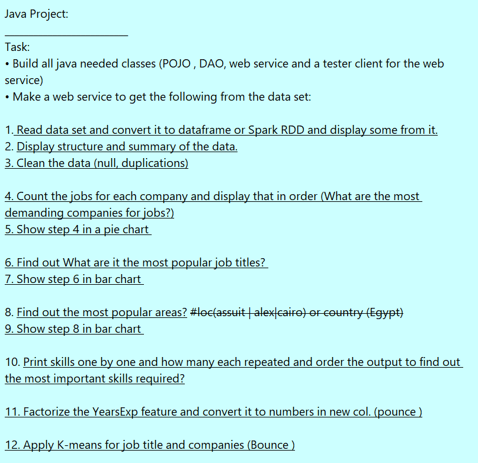

# JavaMachineLearningProjectITI
Machine Learning Project Java Programming Language (Webservices and  Tester Client ) 
# Team Members GR3 ITI:							  						                       
 				1-Abdullah Abdelhakeem.											                     
 				2-Mohamed Sebaie.													                       
 				3-Mostafa Ahmed.													                       	
# Date: 
        - 5 July 2021																                         
# Version: 
        - 0.0.1																	                             
# Project Details :																                       
 			1-Read data set and convert it to dataframe.							                  
 			2-Display structure and summary of the data.							                  
 			3-Clean the data (null, duplications).									                    
 			4-What are the most demanding companies for jobs?						                
 			5-Show step 4 in a pie chart.											                          
 			6-Find out What are it the most popular job titles? 					              
 			7-Show step 6 in bar chart .											                          
 			8-Find out the most popular areas?										                      
 			9-Show step 8 in bar chart .											                          
 			10- * Print skills one by one.											                        
 				  * how many each repeated .											                          
 				  * order the output to find out the most important skills required?.	      
 			11-Factorize the YearsExp feature and convert it to numbers in new col.     
 			12-Apply K-means for job title and companies.	                              
# Main Package : 
      -Smile DataFrame 
      -TableSaw
      -JoinaryDataFrame                      												                              	
 																					                                        

