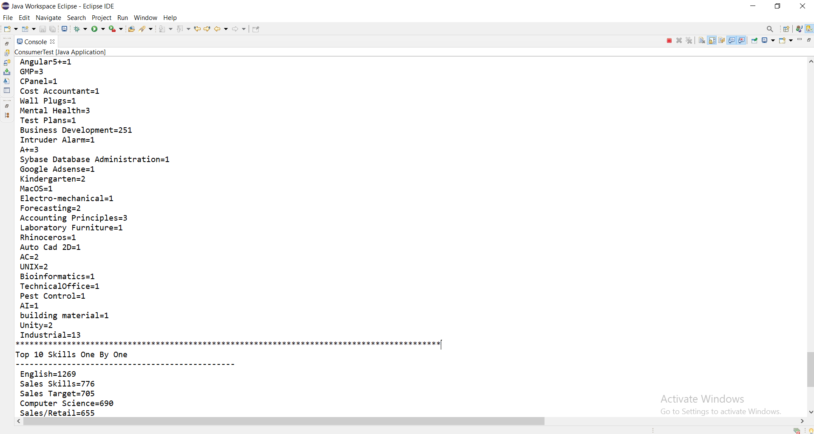

# JavaMachineLearningProjectITI
Machine Learning Project Java Programming Language (Webservices and  Tester Client ) 
# Team Members GR3 ITI:							  						                       
 				1-Abdullah Abdelhakeem.											                     
 				2-Mohamed Sebaie.													                       
 				3-Mostafa Ahmed.													                       	
# Date: 
        - 5 July 2021																                         
# Version: 
        - 0.0.1																	                             
# Project Details :																                       
 			1-Read data set and convert it to dataframe.							                  
 			2-Display structure and summary of the data.							                  
 			3-Clean the data (null, duplications).									                    
 			4-What are the most demanding companies for jobs?						                
 			5-Show step 4 in a pie chart.											                          
 			6-Find out What are it the most popular job titles? 					              
 			7-Show step 6 in bar chart .											                          
 			8-Find out the most popular areas?										                      
 			9-Show step 8 in bar chart .											                          
 			10- * Print skills one by one.											                        
 				  * how many each repeated .											                          
 				  * order the output to find out the most important skills required?.	      
 			11-Factorize the YearsExp feature and convert it to numbers in new col.     
 			12-Apply K-means for job title and companies.	 
 
 <h1>Project run steps</h1>
<h3>Webservices(Server)</h3>
<ol>
  <li>src/main/java
  <ul>ProjectMain (Package)
  <ul>run "JavaMlgr3Application"---> as Spring Boot (Server) </ul></ul></li>
</ol> 
<h3>TesterClient (Client)</h3>
<ol>
  <li>src/main/java
  <ul>Test (Package)
 <ul>run "ConsumerTest" as ---> Java Application <ul>Choose Any WebServices as You Like (from 1------> 13)</ul></ul></ul></li>
</ol> 

 
 
# Main Package : 
      -Smile DataFrame 
      -TableSaw
      -JoinaryDataFrame     
     
<h1>Image Projects</h1>
<h4>Server</h4>
<ol>
  <ul></ul>
</ol>

<h4>Client</h4><ol>
  <ul></ul>
</ol>

<h4>Datframe</h4>
<ol>
  <ul></ul>
</ol>

<h4>Structure and Summary</h4>
<ol>
  <ul></ul>
</ol>

<h4>Data Cleaning</h4>
<ol>
  <ul></ul>
</ol>

<h4>What are the most demanding companies for jobs?</h4>
<ol>
  <ul></ul>
</ol>

<h4>Pie Chart for the most demanding companies for jobs</h4>
<ol>
  <ul></ul>
</ol>

<h4>What are it the most popular job titles?</h4>
<ol>
  <ul></ul>
</ol>

<h4>Bar Chart for the most popular job titles?</h4>
<ol>
  <ul></ul>
</ol>

<h4>the most popular Areas</h4>
<ol>
  <ul></ul>
</ol>

<h4>Bar Chart for the most popular Areas</h4>
<ol>
  <ul></ul>
</ol>
 				
<h4>skills one by one - how many each repeated - order -The most important skills required?
</h4>     
<ol>
  <ul></ul>
</ol>

<h4>Factorize the YearsExp feature and convert it to numbers in new col.</h4>
<ol>
  <ul></ul>
</ol>

<h4> K-means for job title and companies</h4>
<ol>
  <ul></ul>
</ol>

